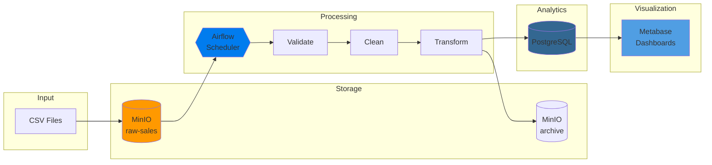

# Mini Data Platform

A production-quality, containerized data platform for processing sales data. Built with modern data engineering practices using Docker Compose.

## Project Overview

This project demonstrates a complete data platform architecture using industry-standard tools. It processes raw sales CSV files through an automated pipeline and delivers business intelligence dashboards.

### Business Problem

An e-commerce company needs to:
- Collect sales data from various sources
- Validate and clean incoming data automatically
- Store clean data for analytics
- Provide self-service dashboards for business users

### Solution

A containerized data platform that automates the entire data lifecycle:

```
CSV Files --> MinIO --> Airflow --> PostgreSQL --> Metabase
 (raw)      (storage)  (process)   (analytics)  (dashboards)
```

## Architecture



### Components

| Component | Purpose | Port |
|-----------|---------|------|
| MinIO | S3-compatible object storage for raw data | 9000, 9001 |
| Airflow | Workflow orchestration and scheduling | 8080 |
| PostgreSQL | Analytics database | 5433 |
| Metabase | Business intelligence dashboards | 3000 |

## Data Flow

1. **Ingest**: Sales CSV files are uploaded to MinIO `raw-sales` bucket
2. **Detect**: Airflow DAG runs every 15 minutes, detecting new files
3. **Validate**: Schema and data types are verified
4. **Clean**: Invalid records removed, data standardized
5. **Transform**: Calculate derived fields (total_amount)
6. **Load**: Insert clean data into PostgreSQL
7. **Archive**: Move processed files to archive bucket
8. **Visualize**: Metabase queries PostgreSQL for dashboards

## Prerequisites

- Docker Desktop (4.0+)
- Docker Compose (v2.0+)
- Python 3.9+ (for data generator)
- 8GB RAM minimum

## Quick Start

### 1. Clone the Repository

```bash
git clone https://github.com/your-org/mini-data-platform.git
cd mini-data-platform
```

### 2. Start the Platform

```bash
docker-compose up -d
```

Wait 2-3 minutes for all services to initialize.

### 3. Verify Services

Check all services are running:

```bash
docker-compose ps
```

Expected output shows all containers as "healthy" or "running".

### 4. Access the UIs

| Service | URL | Credentials |
|---------|-----|-------------|
| Airflow | http://localhost:8080 | admin / admin |
| MinIO | http://localhost:9001 | minioadmin / minioadmin |
| Metabase | http://localhost:3000 | (setup on first visit) |

### 5. Generate Test Data

```bash
cd data-generator
pip install -r requirements.txt
python generate_sales.py --records 500 --upload
```

### 6. Trigger the Pipeline

Option A: Wait for scheduled run (every 15 minutes)

Option B: Trigger manually in Airflow UI:
1. Go to http://localhost:8080
2. Find `sales_data_pipeline` DAG
3. Click the play button to trigger

### 7. View Results

1. Open Metabase at http://localhost:3000
2. Connect to analytics database:
   - Host: `analytics-db`
   - Port: `5432`
   - Database: `analytics`
   - User: `analytics`
   - Password: `analytics`
3. Create dashboards using the `sales` table

## Project Structure

```
mini-data-platform/
├── docker-compose.yml          # Service definitions
├── pyproject.toml              # Python project configuration
├── pytest.ini                  # Test configuration
├── airflow/
│   ├── dags/
│   │   ├── sales_pipeline.py   # Main ETL DAG
│   │   ├── utils/              # Utility modules
│   │   │   ├── __init__.py
│   │   │   ├── logging_config.py   # File-based logging
│   │   │   └── connections.py      # DB/MinIO connections
│   │   ├── validation/         # Data validation
│   │   │   ├── __init__.py
│   │   │   ├── schemas.py      # Pandera schemas
│   │   │   └── validators.py   # Validation logic
│   │   ├── services/           # External service clients
│   │   │   ├── __init__.py
│   │   │   ├── minio_service.py    # MinIO operations
│   │   │   └── postgres_service.py # PostgreSQL operations
│   │   └── transformers/       # Data transformations
│   │       ├── __init__.py
│   │       ├── data_cleaner.py     # Data cleaning
│   │       └── data_enricher.py    # Data enrichment
│   ├── logs/                   # Airflow & pipeline logs
│   └── plugins/                # Custom plugins
├── sql/
│   └── init.sql                # Database schema
├── data-generator/
│   ├── generate_sales.py       # Test data generator
│   └── requirements.txt
├── tests/                      # Comprehensive test suite
│   ├── conftest.py             # Pytest fixtures
│   ├── test_schemas.py         # Pandera schema tests
│   ├── test_validators.py      # Validator tests
│   ├── test_data_cleaner.py    # Cleaner tests
│   ├── test_data_enricher.py   # Enricher tests
│   ├── test_minio_service.py   # MinIO service tests
│   ├── test_postgres_service.py # PostgreSQL service tests
│   └── test_integration.py     # End-to-end tests
├── docs/
│   ├── black_box_learning.md
│   ├── project_walkthrough.md
│   ├── dashboard_requirements.md
│   └── cicd_overview.md
├── .github/
│   └── workflows/
│       └── ci.yml              # CI/CD pipeline
└── README.md
```

## Architecture & Separation of Concerns

The project follows clean architecture principles with clear separation:

### Validation Layer (Pandera)

Uses [Pandera](https://pandera.readthedocs.io/) for declarative data validation:

```python
# Define schema with Pandera
class CleanedSalesSchema(pa.DataFrameModel):
    order_id: Series[str] = pa.Field(str_matches=r"^ORD-\d{6}$")
    quantity: Series[int] = pa.Field(ge=1, le=10000)
    unit_price: Series[float] = pa.Field(gt=0, le=100000)
    # ... more fields
```

**Validation stages:**
1. **RawSalesSchema** - Validates incoming CSV structure
2. **CleanedSalesSchema** - Validates cleaned data types and constraints
3. **EnrichedSalesSchema** - Validates final data with calculated fields

### Service Layer

Service classes encapsulate external dependencies:

- **MinIOService** - File detection, download, upload, archiving
- **PostgresService** - Data loading, queries, health checks

### Transformer Layer

Data transformation classes:

- **DataCleaner** - Deduplication, type conversion, missing value handling
- **DataEnricher** - Calculated fields, aggregations, metadata

### Logging

File-based logging instead of console:
- `logs/pipeline/sales_pipeline.log` - All pipeline logs
- `logs/pipeline/sales_pipeline_errors.log` - Errors only
- Daily rotating log files

## Running Tests

```bash
# Install test dependencies
pip install -r tests/requirements.txt

# Run all tests
pytest tests/ -v

# Run with coverage
pytest tests/ --cov=airflow/dags --cov-report=html

# Run specific test files
pytest tests/test_schemas.py -v
pytest tests/test_integration.py -v
```

## Running the Pipeline

### Automatic Runs

The pipeline runs automatically every 15 minutes when data is present in the `raw-sales` bucket.

### Manual Trigger

```bash
# Via Airflow CLI
docker exec airflow-webserver airflow dags trigger sales_data_pipeline

# Via Airflow UI
# Navigate to DAGs > sales_data_pipeline > Trigger DAG
```

### Monitor Progress

1. **Airflow UI**: View task status, logs, and history
2. **Docker logs**: `docker-compose logs -f airflow-scheduler`
3. **PostgreSQL**: `docker exec analytics-db psql -U analytics -c "SELECT COUNT(*) FROM sales"`

## Dashboard Access

### Metabase Setup (First Time)

1. Navigate to http://localhost:3000
2. Create admin account
3. Add database connection:
   - Type: PostgreSQL
   - Host: analytics-db
   - Port: 5432
   - Database: analytics
   - User: analytics
   - Password: analytics

### Create Dashboards

See [Dashboard Requirements](docs/dashboard_requirements.md) for detailed specifications.

Recommended dashboards:
- **Sales Over Time**: Line chart of daily revenue
- **Sales by Country**: Geographic distribution
- **Top Products**: Best-selling items
- **Average Order Value**: Customer spending trends

## CI/CD Pipeline

The project includes a GitHub Actions workflow that runs on every push:

### CI Checks

| Check | Purpose |
|-------|---------|
| Lint | Code style (flake8, black) |
| DAG Validation | Airflow syntax check |
| SQL Validation | Schema syntax |
| Docker Build | Container build test |
| Security Scan | Vulnerability detection |

### Running CI Locally

```bash
# Lint Python
pip install flake8 black
flake8 airflow/dags/ data-generator/
black --check airflow/dags/ data-generator/

# Validate DAGs
python -c "from airflow.models import DagBag; d = DagBag('airflow/dags/')"

# Build containers
docker-compose build
```

See [CI/CD Overview](docs/cicd_overview.md) for full documentation.

## Configuration

### Environment Variables

Key configuration in `docker-compose.yml`:

```yaml
# MinIO
MINIO_ROOT_USER: minioadmin
MINIO_ROOT_PASSWORD: minioadmin

# PostgreSQL Analytics
POSTGRES_USER: analytics
POSTGRES_PASSWORD: analytics
POSTGRES_DB: analytics

# Airflow
AIRFLOW__CORE__EXECUTOR: LocalExecutor
```

### Customization

- **Schedule**: Modify `schedule_interval` in `airflow/dags/sales_pipeline.py`
- **Validation Rules**: Update `validate_schema()` function
- **Cleaning Rules**: Update `clean_data()` function

## Troubleshooting

### Services Won't Start

```bash
# Check logs
docker-compose logs

# Restart services
docker-compose down
docker-compose up -d
```

### DAG Not Appearing

```bash
# Check for import errors
docker exec airflow-webserver airflow dags list-import-errors

# Restart scheduler
docker-compose restart airflow-scheduler
```

### MinIO Connection Failed

```bash
# Verify MinIO is running
curl http://localhost:9000/minio/health/live

# Check bucket exists
docker exec minio mc ls myminio/raw-sales
```

### PostgreSQL Connection Failed

```bash
# Verify database is ready
docker exec analytics-db pg_isready -U analytics

# Check table exists
docker exec analytics-db psql -U analytics -c "\dt"
```

## Stopping the Platform

```bash
# Stop containers (preserve data)
docker-compose down

# Stop and remove all data
docker-compose down -v
```

## Screenshots

### Airflow DAG View
*[Screenshot placeholder: Airflow DAG graph showing task dependencies]*

### MinIO Console
*[Screenshot placeholder: MinIO browser showing raw-sales bucket]*

### Metabase Dashboard
*[Screenshot placeholder: Sales dashboard with charts]*

### Pipeline Success
*[Screenshot placeholder: Airflow showing successful DAG run]*

## Documentation

- [Black Box Learning Guide](docs/black_box_learning.md) - Structured learning path
- [Project Walkthrough](docs/project_walkthrough.md) - Why and how decisions were made
- [Dashboard Requirements](docs/dashboard_requirements.md) - BI specifications
- [CI/CD Overview](docs/cicd_overview.md) - Pipeline documentation

## Contributing

1. Fork the repository
2. Create a feature branch
3. Make changes and test locally
4. Run CI checks: `./scripts/run-ci.sh`
5. Submit a pull request

## License

MIT License - See LICENSE file for details.

## Acknowledgments

Built with:
- [Apache Airflow](https://airflow.apache.org/)
- [MinIO](https://min.io/)
- [PostgreSQL](https://www.postgresql.org/)
- [Metabase](https://www.metabase.com/)
